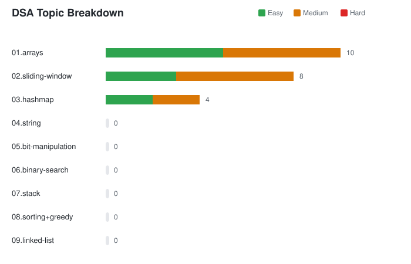

# DSA Practice

A personal collection of Data Structures and Algorithms problems, solved and organized topic-wise. This repo is my running log of practice as I prepare for technical interviews, mainly with an AI/ML and Data Science angle in mind.

## Table of Contents

- [Structure](#structure)
- [Progress Breakdown](#progress-breakdown)
- [Why this repo exists](#why-this-repo-exists)
- [A few tips](#a-few-tips)
- [Note](#note)

## Structure

Every [topic](/topics.txt) gets its own folder. Inside, files are named by difficulty and a running number, so it stays easy to scan and sort.

```
dsa-practice/
├── 01.arrays/
│   ├── easy_001_two_sum.py
│   ├── med_002_product_except_self.py
│   └── med_003_product_of_array_except_itself.py
├── 02.sliding-window/
├── 03.hashmap/
├── 04.string/
├── ...
├── ...
├── 08.sorting+greedy/
├── 09.linked-list/
```

Naming convention: `<difficulty>_<number>_<problem_name>.py`
Difficulty is one of `easy`, `med`, or `hard`.

## Progress Breakdown

A quick visual of how solutions are spread across topics and difficulty levels, updated as I add more problems.

<p align="center">
  
</p>

## Why this repo exists

Most interview prep advice says to grind hundreds of problems. In practice, a smaller set of well-understood patterns takes you a lot further than a large pile of half-remembered solutions. This repo is where I implement and revisit those patterns until they are second nature, not just something I solved once and forgot.

I wrote up the full reasoning and the actual problem list behind this repo here: [The Only DSA List You Need for AI/ML and Data Science Interviews](https://shivam-ai.hashnode.dev/the-only-dsa-list-you-need-for-ai-ml-data-science-interviews).

## A few tips

1. **Solve before you look.** Give every problem an honest attempt on your own first, even if it takes a while. The struggle is where the pattern actually sticks.
2. **Revisit, don't just collect.** Coming back to a problem after a week and solving it again is worth more than solving ten new ones in a row.
3. **Say it out loud.** Practice explaining your approach as if you were in an interview. If you can't explain it simply, you probably don't understand it as well as you think.

## Note

These are my own solutions written while practicing, not always the most optimal ones on the first pass. Suggestions and corrections are welcome via issues or pull requests.